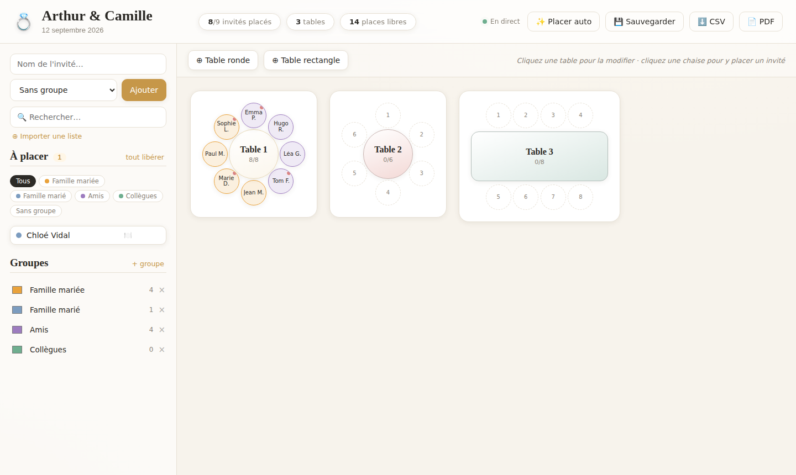

# 💍 Plan de table

Un logiciel **simple, beau et intuitif** pour créer le plan de table d'un mariage.
Inscrivez vos invités, créez vos tables, glissez-déposez chacun à sa place, et
visualisez la salle en un coup d'œil.



## Fonctionnalités

- **Collaboratif en temps réel** : plusieurs personnes ouvrent la même page et voient
  **les mêmes changements en direct**. Dès qu'un participant ajoute un invité, place
  quelqu'un ou modifie une table, l'écran de tout le monde se met à jour automatiquement
  (indicateur « ● En direct »). Aucune actualisation nécessaire.
- **Fonctionne hors-ligne** : l'application **continue de marcher sans réseau** (sur le lieu
  de réception, en sous-sol…). Vous pouvez ajouter et placer des invités, déplacer des
  tables… ; tout est gardé localement et **se synchronise automatiquement** dès le retour
  de la connexion (l'indicateur affiche « Hors ligne · N en attente » puis se resynchronise).
  La page se charge même sans réseau (service worker).
- **Inscription des invités** en un clic, avec groupes colorés (famille, amis, collègues…),
  **régime / allergies alimentaires** et notes par invité (badge 🍽️ et point rouge sur la chaise).
- **Import Excel / CSV avec choix des colonnes** : déposez un fichier `.xlsx` ou `.csv`,
  associez vos colonnes (Nom, Groupe, Régime/Allergies, Notes) — détection automatique des
  en-têtes et aperçu avant import. (Ou collez simplement une liste de noms.)
- **Sauvegarde & restauration** : exportez tout le plan (tables + placement + invités) dans un
  fichier `.json` (💾 Sauvegarder), puis rechargez-le plus tard pour tout restaurer à l'identique.
- **Plan de salle 2D** : disposez librement les tables en les **glissant** (souris ou
  tactile), et **décorez** le plan (plante 🪴, lavande 🪻, fleurs 💐, arbre 🌳, arche 💒,
  piste de danse 💃, buffet 🍽️, pièce montée 🎂, DJ 🎶, entrée 🚪, maison 🏠…) —
  chaque élément est déplaçable, redimensionnable et légendable. Bouton **⊞ Ranger**
  pour réaligner les tables en grille en un clic.
- **Actions sur une table** : depuis le panneau d'édition, **Vider la table** (renvoie tout
  le monde dans « À placer ») ou **déplacer tous ses invités vers une autre table**.
- **Tables visuelles** rondes ou rectangulaires, avec chaises tout autour, de
  **2 à 100 places** (les chaises et la table s'adaptent automatiquement à la taille).
- **Plusieurs façons de remplir une chaise** :
  - **Clic sur une chaise vide** → **popup** listant les invités non placés : on choisit qui
    asseoir là (avec recherche), ou on crée un nouvel invité directement à cette place ;
  - **Clic-pour-placer** (idéal tactile/mobile) : on clique un invité, puis une chaise ;
  - **Glisser-déposer** un invité sur une chaise.
- **Échanger deux invités** : bouton **⇄** sur une chaise → cliquer l'autre place (ou
  glisser l'un sur l'autre) — les deux personnes permutent.
- **Édition de table en un clic** : cliquez une table pour ouvrir un panneau clair —
  nom, **nombre de places** (stepper ou saisie directe, jusqu'à 100), forme
  ronde ↔ rectangulaire, **couleur d'arrière-plan** (palette élégante), suppression.
- **Placement automatique** (✨) intelligent : remplit les places libres en gardant
  chaque groupe **à la même table** quand c'est possible.
- **Filtre par groupe** et **recherche** instantanée dans la liste des invités.
- **Compteurs en direct** : invités placés, tables, places libres.
- **Export CSV/Excel** (⬇️) — avec colonnes Régime/Allergies et Notes.
- **Export PDF** (📄) soigné : page de garde, **plan visuel des tables**, répartition par table,
  index alphabétique des invités → table, et **récapitulatif des régimes & allergies** (pour le traiteur).
- **Affiche élégante** (🖼️) : une belle affiche à imprimer/encadrer, avec une **calligraphie
  de mariage**, cadre doré, et **uniquement les noms regroupés par table**.
- **Mobile-first** : sur téléphone, deux onglets en bas de l'écran (**👥 Invités** / **🪑 Plan
  de table**) ; sur ordinateur, la liste et le plan s'affichent côte à côte.
- **Tout réinitialiser** (🗑️) avec **double vérification** (case à cocher + confirmation finale)
  pour repartir de zéro sans risque.
- **Sauvegarde automatique** dans une base de données **SQLite locale**.
  Tout reste sur votre machine, fonctionne hors-ligne.

## Démarrage

```bash
npm install
npm start
```

Puis ouvrez **http://localhost:3000**.

> Pour développer avec rechargement auto : `npm run dev`.

## Déploiement (Railway, etc.)

L'app démarre avec `npm start` et écoute sur le port fourni par `process.env.PORT`
(3000 par défaut) — aucune configuration spéciale n'est requise.

> ⚠️ **Persistance des données.** Sur les hébergeurs au système de fichiers
> éphémère (Railway, Render…), le fichier `data.sqlite` est effacé à chaque
> redéploiement **sauf** s'il est stocké sur un **volume persistant**.
>
> **Le plus simple (Railway) :** ajoutez un **volume** monté sur **`/data`**.
> C'est tout — l'app détecte automatiquement `/data` s'il est accessible en
> écriture et y range la base. Aucune variable d'environnement à définir.
>
> Pour un autre point de montage, utilisez une variable :
>
> | Variable | Effet |
> | --- | --- |
> | `DATA_DIR` | Dossier où créer `data.sqlite` (ex. le point de montage du volume) |
> | `SQLITE_PATH` | Chemin complet du fichier de base (prioritaire sur `DATA_DIR`) |
>
> 💡 En complément, le bouton **💾 Sauvegarder** exporte tout le plan dans un
> fichier `.json` que vous pouvez restaurer à tout moment — une sauvegarde
> manuelle qui ne dépend d'aucun hébergeur.

## Comment ça marche

| Action | Geste |
| --- | --- |
| Ajouter un invité | Saisir le nom + (groupe) → **Ajouter** |
| Importer une liste | **⊕ Importer une liste** → coller les noms (un par ligne) |
| Créer une table | **⊕ Table ronde / rectangle** dans la barre du plan |
| Choisir qui placer à une chaise | Cliquer une **chaise vide** → **popup** des invités non placés → choisir (ou créer un nouvel invité) |
| Placer un invité (souris) | Glisser sa pastille depuis « À placer » vers une chaise |
| Placer un invité (tactile) | Cliquer l'invité (il s'illumine) puis cliquer une chaise |
| **Échanger deux invités** | Survoler une chaise → bouton **⇄** → cliquer l'autre place (ou glisser l'un sur l'autre) |
| Modifier un invité assis | Cliquer la personne sur sa chaise → sa fiche s'ouvre |
| Retirer un invité d'une table | Survoler sa chaise → bouton **×** (ou le glisser vers « À placer ») |
| Modifier un invité (régime, etc.) | Survoler sa pastille → **✎** → nom, groupe, régime/allergies, notes |
| Importer un fichier Excel/CSV | **⊕ Importer une liste** → choisir le fichier → associer les colonnes → Importer |
| Modifier une table | **Cliquer la table** → panneau (nom, places, forme, arrière-plan, suppression) |
| Régler le nombre de places | Dans le panneau : boutons +/− ou saisie directe (jusqu'à 100) |
| Changer la couleur de table | Dans le panneau : choisir une pastille d'« Arrière-plan » |
| Sauvegarder / restaurer | **💾 Sauvegarder** (fichier .json) · restaurer via « Importer » |
| Exporter | **⬇️ CSV** (Excel) ou **📄 PDF** |
| Tout réinitialiser | **🗑️ Réinitialiser** → cocher la confirmation → confirmer |
| Naviguer sur mobile | Onglets du bas : **👥 Invités** / **🪑 Plan de table** |

## Pile technique

- **Backend** : Node.js + Express + `better-sqlite3` (base de données embarquée) + `xlsx` (lecture Excel/CSV).
- **Frontend** : HTML/CSS/JS natif, sans étape de build — léger et rapide.
- **Temps réel** : Server-Sent Events (`/api/events`) — le serveur pousse un signal à tous
  les navigateurs connectés après chaque modification, et chacun se resynchronise (sans
  dépendance externe ni WebSocket).
- **Base de données** : SQLite locale (`data.sqlite`), créée automatiquement au premier lancement.

## Structure

```
server.js        API REST + serveur statique
db.js            schéma SQLite + données par défaut
public/          interface (index.html, styles.css, app.js)
```
